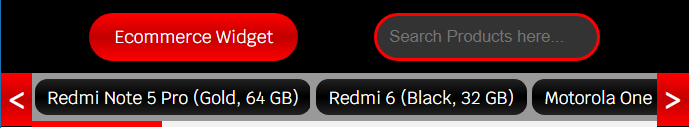
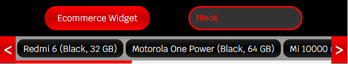
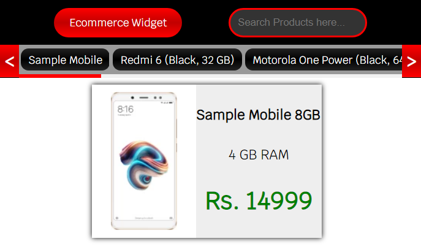

# E-Commerce-Chrome-Extension
A Chrome extension/widget for E-Commerce Web Sites

#How it works ?

<b>We simply first fetch product data from a api using AJAX ,Which automatically starts as soon as we press the extension icon</b> 

<b>Then if everything goes well, the result would look like this</b> 

<b>Now we can filter our search if we want</b> 

<b>Or we can see the details of product by just hovering over it</b> 

#How to use it ?

Just clone the repo or download as a zip. Now in order to see the extension live in action follow steps stated below -   
-> Open Chrome  
-> Click Hamburger (three dots)  
-> Navigate to More Tools  
-> Naviagte to Extensions  
-> Power on developer mode if not done already  
-> Click on Load Unpacked  
-> Select the extracted/Cloned folder   
-> Now just click the icon and enjoy the result  

